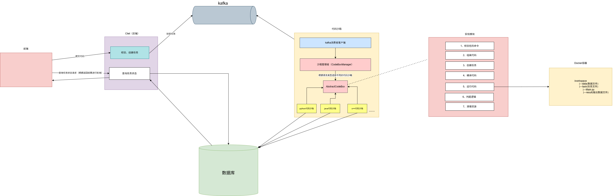

# 🎯 CodeRank - 在线判题系统(持续完善中...)

一个高性能、高可用的**在线编程判题系统**，提供代码执行、判题、排行榜等功能。

---

## 📋 项目简介

CodeRank 是一个完整的在线编程练习和判题平台。用户可以提交代码解答问题，系统实时执行代码、检验答案正确性，并提供详细的执行反馈。支持多语言编程，提供排行榜、题目管理等功能。

**核心特性：**
- ✅ 实时代码执行与判题
- 📚 题库管理与分类
- 🔐 安全的用户认证与授权
- ⚡ 高速缓存与队列处理

---

## 🏭 项目实现原理

---

## 📄 许可证

本项目采用 [Apache 2.0](LICENSE) 许可证。

---

## 👨‍💻 联系方式

- **邮箱**: 3136188547@qq.com
- **维护者**: 大菜鸟

---

## 🙏 致谢

感谢所有使用和支持本项目的用户！

---

**⭐ 如果这个项目对你有帮助，请给个 Star ~**

